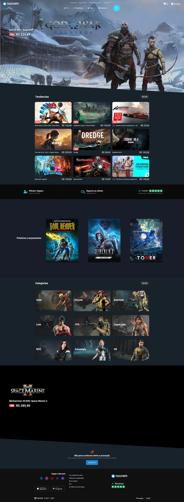

# Nuuvem - Digital game store

<!--  -->

## 📋 Overview

Nuuvem is a modern digital game store designed to provide users with a seamless and immersive shopping experience. This project showcases a responsive, interactive front-end implementation of a gaming marketplace with a focus on stunning UI/UX design and smooth, engaging animations.

## ✨ Features

- **Game Catalog**: Interactive game catalog with detailed information and screenshots
- **Game Details**: Detailed information and screenshots for selected games
- **Game Reviews**: User reviews and ratings for popular games
- **Interactive Card Visualization**: 3D card animations and interactive display
- **Responsive Design**: Fully responsive layout that works on all devices
- **Modern UI Components**: Accordions, interactive icons, and animated elements

## 🛠️ Technologies
<div align="center">
    <div>
        
        
        
    </div>
</div>

The project is built using the following technologies:

### Frontend
- **HTML5** - Semantic structure and content
- **CSS3** - Advanced styling with flexbox, grid, and animations
- **JavaScript** - DOM manipulation and interactive elements

### Libraries
- **GSAP** - Advanced animations and transitions
- **ScrollTrigger** - Scroll-based animations
- **SVG-Inject** - SVG handling and manipulation

### Design
- **Google Fonts** - "M PLUS 1" and "Red Hat Display" fonts
- **Custom SVG Icons** - Extensive use of SVG assets for crisp, scalable graphics
- **CSS Animations** - Keyframe animations and transitions

## 🏗️ Project Structure

```
├── css
│   ├── style.css
│   └── style_glitch.css
├── image
│   ├── 3d
│   │   ├── dark_rider-title.png
│   │   ├── legacy-of-kain-soul-reaver-12-remastered-n5sa8.jpg
│   │   ├── raziel-and-kain.jpg
│   │   ├── stalker-2-deluxe.webp
│   │   └── stalker2.jpg
│   ├── logos
│   │   ├── nuuvem-icon.svg
│   │   └── nuuvem-logo.svg
│   └── gift-solid-white.svg
├── js
│   ├── app.js
├──thumbnails
├──video
├── index.html

```

## 🌟 Key Functionalities

### Interactive Game Catalog
The game catalog features:
- Search functionality
- Filter options
- Sort options

### Responsive 3d Card Designs
The digital cards feature:
- 3D animations
- Front and back visualization
- Security features showcase

### Interactive Navigation
- Smooth scrolling
- Header transformation on scroll
- Interactive accordion elements

## 🚀 Getting Started

1. Clone the repository:
```bash

git clone https://github.com/patriqueporto/nuuvem_clone.git
```

2. Open the project in your code editor

3. Launch the index.html file in a modern web browser

## 📱 Browser Compatibility

The application is optimized for modern browsers:
- Chrome (latest)
- Firefox (latest)
- Safari (latest)
- Edge (latest)

## 🖼️ Screenshots

 

## 👨‍💻 Development

The project uses vanilla JavaScript with GSAP for animations. Key development features include:

- Modular JavaScript organization
- CSS variables for consistent theming
- Responsive design with carefully crafted breakpoints
- SVG integration for crisp graphics
- Performance optimizations for smooth animations

## 🤝 Contributing

Contributions, issues, and feature requests are welcome! Feel free to check the [issues page](https://github.com/your-username/nuuvem_clone/issues).

## 📝 License

This project is [MIT](LICENSE) licensed.

---

Developed with ❤️ by [Patrique P Porto](https://github.com/patriqueporto)